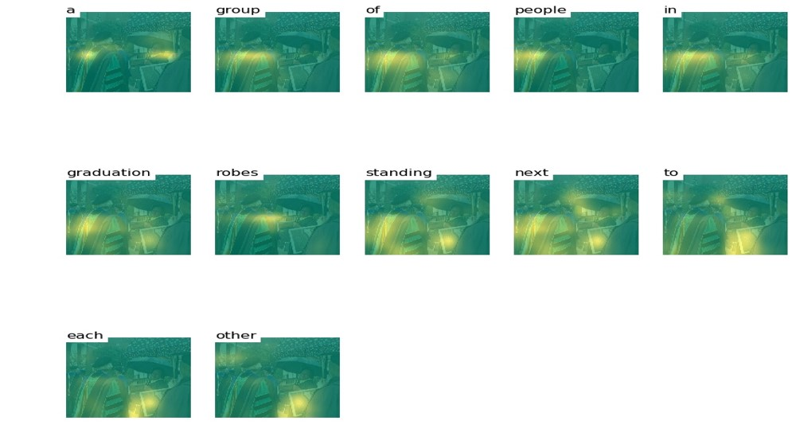
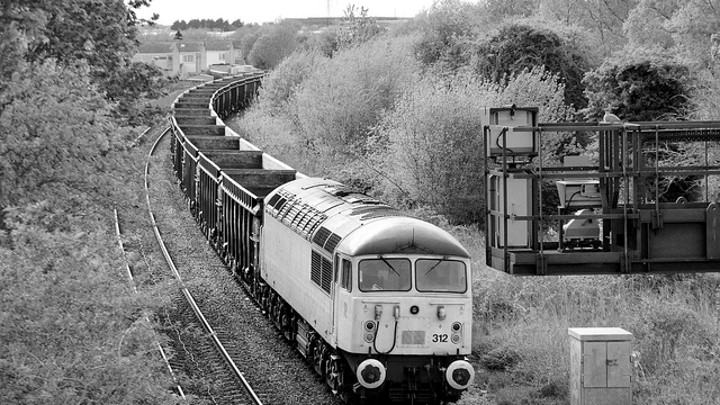
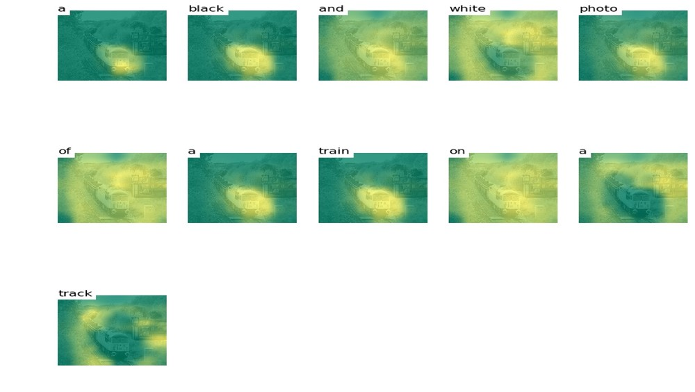

# Image-Captioning
## The model

## some Examples
Input                      |  Output
:-------------------------:|:-------------------------:
  |  
:-------------------------:|:-------------------------:
  |  

